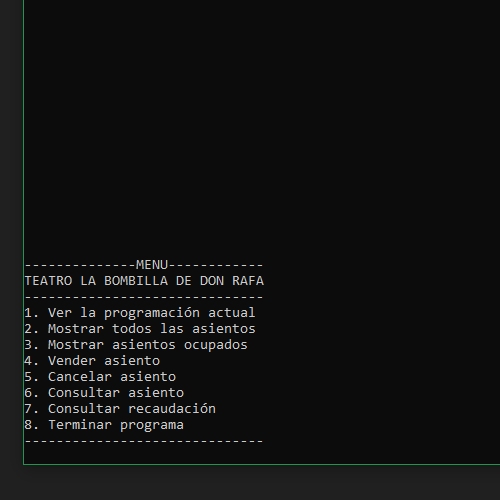

# Teatro-Java

Pequeño proyecto que simula el menú de un teatro en Java.

Este teatro incluye las clases:

- Teatro: hace referencia en sí, y contiene un método para mostrar la información del teatro. 

- Obra: hace referencia a la obra que se está mostrando en el teatro, y contiene métodos para mostrar la información sobre la obra, para mostrar el precio, para crear los asientos, y para mostrar los asientos (si están vendidos o no).

- Localidad: hace referencia a un asiento, e incluye métodos para calcular el precio según edad, para comprobar el tipo de asiento, para vender el asiento, para mostrar información del asiento o para cancelar la reserva.

Además, existe una clase principal con un menú para navegar por el teatro:
